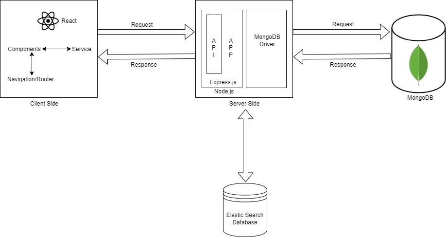

# Team-Project-22
<h2>Recruit Me - Recruiting Web Application having Tinder Like UI</h2>

<h3>Problem and Goals:</h3>
With thousands of applicants applying for a job position, it is very difficult to keep track of all the applicants applied and the number of 	applicants selected/rejected in a particular round. Many recruiting platforms that are there today don’t provide an intuitive UI which makes the recruitment process as a recruiter and applying for jobs as a job seeker, boring and tedious. We intend to make a full-fledged web based application having all the necessary features needed for recruiting which will recommend the suitable candidates to the recruiter and suitable jobs to the job seeker. This web app will have an intuitive UI just like Tinder where the recruiter/candidate can swipe left and right the candidates/job opening respectively. 

<h3>Methodology:</h3>
We have adopted the following methodology in order: 
1)	Design the database schema to store candidate information, Job information, Recruitment Process information. 
2)	Create the backend functionality using NodeJs. 
3)	Create frontend functionality using ReactJs. 
4)	Use Elastic Search for recommendation. 
5)	Deploy the application on AWS. 

<h3>Technologies:</h3>
We have used the following technologies for this project: 
1)	MongoDB database 
2)	Express.js 
3)	React 
4)	Node.js 
5)	Amazon Web Services 
6)	Elastic Search 
